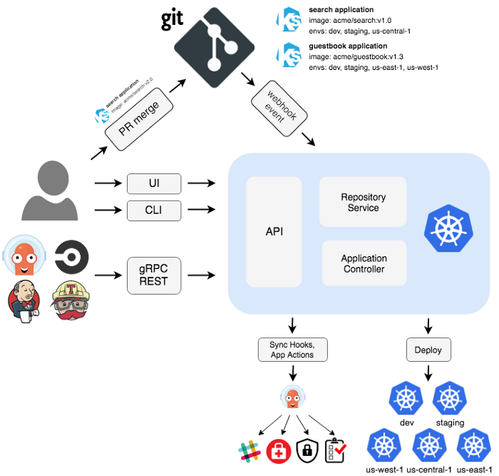

Argo  for Kubernetes
====================

**What is Argo Project ?**

Argo an open source Container-Native workflow engine for Kubernetes conceived at `Applatix <https://argoproj.github.io/>`_.

The emergence of containers and Kubernetes is driving a major shift in how applications and services will be developed, distributed, and deployed in the future. An integrated workflow engine is fundamental in a distributed system for orchestrating jobs as well as distributing and deploying complex microservices-based applications. Each step in the workflow is implemented as a container.

**Key Resources**

* Github Page
   https://github.com/argoproj/argo

* Argo Getting Started Guide
   https://github.com/argoproj/argo/blob/master/demo.md

* Video Tutorial
   https://www.youtube.com/watch?v=OdzH82VpMwI

* Interesting Read
   https://itnext.io/argo-workflow-engine-for-kubernetes-7ae81eda1cc5

* Applatix Website
   `Applatix <https://argoproj.github.io/>`_

* Argo Slack Channel `Join  <https://join.slack.com/t/argoproj/shared_invite/enQtMzExODU3MzIyNjYzLTA5MTFjNjI0Nzg3NzNiMDZiNmRiODM4Y2M1NWQxOGYzMzZkNTc1YWVkYTZkNzdlNmYyZjMxNWI3NjY2MDc1MzI>`_

**Architecture**

|
|

|
|

**Key Components of Argo**

- `Argo Workflows <https://argoproj.github.io/argo/>`_    Container-native Workflow Engine
- `Argo CD <https://argoproj.github.io/argo-cd/>`_   Declarative GitOps Continuous Delivery
- `Argo Events <https://argoproj.github.io/argo-events/>`_  Event-based Dependency Manager
- `Argo Rollouts <https://argoproj.github.io/argo-rollouts/>`_ Deployment CR with support for Canary and Blue Green deployment strategies

**Argo Workflows**

Argo Workflows is an open source container-native workflow engine for orchestrating parallel jobs on Kubernetes. Argo Workflows is implemented as a Kubernetes CRD (Custom Resource Definition).

- Define workflows where each step in the workflow is a container.
- Model multi-step workflows as a sequence of tasks or capture the dependencies between tasks using a graph (DAG).
- Easily run compute intensive jobs for machine learning or data processing in a fraction of the time using Argo Workflows on Kubernetes.
- Run CI/CD pipelines natively on Kubernetes without configuring complex software development products.

**Why Argo Workflows?**

- Designed from the ground up for containers without the overhead and limitations of legacy VM and server-based environments.
- Cloud agnostic and can run on any Kubernetes cluster.
- Easily orchestrate highly parallel jobs on Kubernetes.
- Argo Workflows puts a cloud-scale supercomputer at your fingertips.

**Argo CD**

Argo CD is a declarative, GitOps continuous delivery tool for Kubernetes. Argo CD follows the GitOps pattern of using Git repositories as the source of truth for defining the desired application state.Argo CD automates the deployment of the desired application states in the specified target environments. Application deployments can track updates to branches, tags, or pinned to a specific version of manifests at a Git commit.

**Argo Events**

Argo Events is an event-based dependency manager for Kubernetes which helps you define multiple dependencies from a variety of event sources like webhook, AWS S3, schedules, streams etc. and trigger Kubernetes objects after successful event dependencies resolution.

**Argo Rollouts**

Argo Rollouts introduces a new custom resource called a Rollout to provide additional deployment strategies such as Blue-Green and Canary to Kubernetes. The Rollout custom resource provides feature parity with the deployment resource with additional deployment strategies. Check out the Deployment Concepts for more information on the various deployment strategies.

Argo Getting Started
++++++++++++++++++++

To see how Argo works, you can run examples of simple workflows and workflows that use artifacts. For the latter, you'll set up an artifact repository for storing the artifacts that are passed in the workflows. Here are the requirements and steps to run the workflows.

**Requirements**

- Install Kubernetes 1.9 or later
- Install kubectl
- Have  kubeconfig file (default location is ~/.kube/config)

Continue with the instructions here   https://argoproj.github.io/docs/argo/demo.html

**Contribute to Argo Project**

If you want to contribute to the  Argo Community, please  contact saradhi_sreegiriraju@intuit.com for more information.