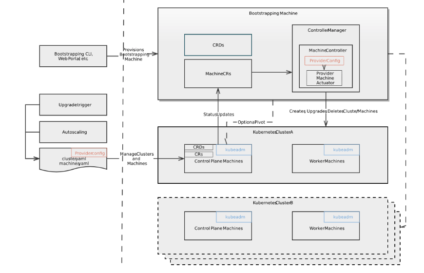

Cluster API for Kubernetes
==========================

**What is Cluster API ?**

The Cluster API is a Kubernetes project to bring declarative, Kubernetes-style APIs to cluster creation, configuration, and management. It provides optional, additive functionality on top of core Kubernetes. One of the aims of the `Cluster <https://cluster-api.sigs.k8s.io/GLOSSARY.html#cluster>`_
API project is to leverage the relative uniformity of Kubernetes APIs and associated tooling to make it easier for ordinary users to access computational resources in a portable way. The initial Alpha release came out in March 2019

We plan to use Cluster API  for Cluster Management  with `Airship 2.0 <https://wiki.openstack.org/wiki/Airship>`_
for Cloud10.

**Key Resources**

* Github Page
   https://github.com/kubernetes-sigs/cluster-api

* Cluster API Documentation
   https://cluster-api.sigs.k8s.io/

* Video Tutorial
   https://youtube.com/watch?v=sCD50fO95hI

**Existing Providers**

A great way to become acquainted with the Cluster API is to start using it. There are multiple implementations of the Cluster API for different environments. These implementations are called providers. To find a partial list of the existing providers see the Cluster API `Provider Implementations List <https://github.com/kubernetes-sigs/cluster-api/blob/master/README.md#provider-implementations>`_
.

OpenStack is one of the providers.  To implement  Cluster API on  OpenStack  go to  https://github.com/kubernetes-sigs/cluster-api-provider-openstack

**Architecture**

**Key Components of Cluster API**

- Cluster Resources

- ClusterSpec

- ClusterStatus

``Cluster Resources``

A Cluster represents the global configuration of a Kubernetes cluster.

``Cluster``

A `Cluster <https://cluster-api.sigs.k8s.io/GLOSSARY.html#cluster>`_
has 4 fields:

``Spec`` contains the desired cluster state specified by the object. While much of the Spec is defined by users, unspecified parts may be filled in with defaults or by Controllers such as autoscalers.

``Status`` contains only observed cluster state and is only written by controllers. Status is not the source of truth for any information, but instead aggregates and publishes observed state.

``TypeMeta`` contains metadata about the API itself - such as Group, Version, Kind.

``ObjectMeta`` contains metadata about the specific object `instance <https://cluster-api.sigs.k8s.io/GLOSSARY.html#instance>`_
, for example, it's name, namespace, labels, and annotations, etc. ``ObjectMeta`` contains data common to most objects.

.. code-block:: go

    type Cluster struct {
    metav1.TypeMeta   `json:",inline"`
    metav1.ObjectMeta `json:"metadata,omitempty"`

    Spec   ClusterSpec   `json:"spec,omitempty"`
    Status ClusterStatus `json:"status,omitempty"`

   }

``ClusterSpec``

The ``ClusterNetwork`` field includes the information necessary to configure kubelet networking for ``Pods`` and ``Services``.

The ``ProviderSpec`` is recommended to be a serialized API object in a format owned by that `provider <https://cluster-api.sigs.k8s.io/GLOSSARY.html#provider>`_
. This will allow the configuration to be strongly typed, versioned, and have as much nested depth as appropriate. These provider-specific API definitions are meant to live outside of the `Cluster <https://cluster-api.sigs.k8s.io/GLOSSARY.html#cluster>`_  API, which will allow them to evolve independently of it.

.. code-block:: go

    type ClusterSpec struct {
    ClusterNetwork ClusterNetworkingConfig `json:"clusterNetwork"`
    ProviderSpec ProviderSpec `json:"providerSpec,omitempty"`

    }

``ClusterStatus``

Like ``ProviderSpec``, ``ProviderStatus`` is recommended to be a serialized API object in a format owned by that `provider <https://cluster-api.sigs.k8s.io/GLOSSARY.html#provider>`_
.

Cluster API on OpenStack
++++++++++++++++++++++++

Complete information is available  at https://github.com/kubernetes-sigs/cluster-api-provider-openstack

**Create Cluster on Openstack**

``Prerequisites``

1) Install kubectl (you need version 1.14.0+)

2) You can use either VM, container or existing Kubernetes cluster act as bootstrap cluster). Here we will use an existing Kubernetes cluster to bootstrap.

3) Install a configured Go development environment. (https://golang.org/doc/install)

4) Build the clusterctl tool

.. code-block:: console

  git clone https://github.com/kubernetes-sigs/cluster-api-provider-openstack $GOPATH/src/sigs.k8s.io/cluster-api-provider-openstack
  cd $GOPATH/src/sigs.k8s.io/cluster-api-provider-openstack/
  make clusterctl

**Cluster Creation (Using an existing Kubernetes cluster to bootstrap)**

1) Create the cluster.yaml, machines.yaml, provider-components.yaml, and addons.yaml files needed

.. code-block:: console

   cd examples/openstack
   ./generate-yaml.sh [options] <path/to/clouds.yaml> <openstack cloud> <provider os: [centos,ubuntu,coreos]> [output folder]
   cd ../..

2) Execute the cluster create command

.. code-block:: console

   ./clusterctl create cluster --bootstrap-cluster-kubeconfig ~/.kube/config \
   --provider openstack -c examples/openstack/out/cluster.yaml \
   -m examples/openstack/out/machines.yaml \
   -p examples/openstack/out/provider-components.yaml
