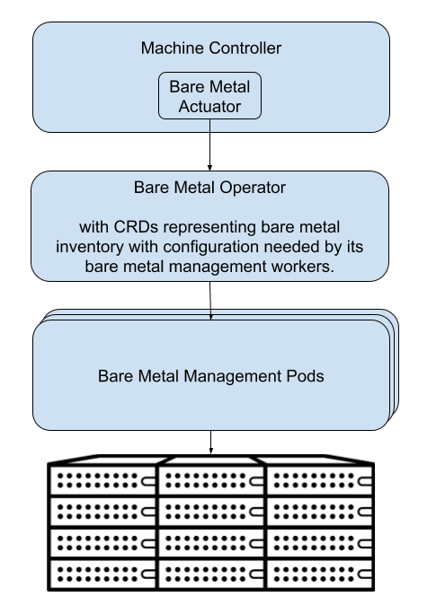

Metal³-Bare Metal Provisioning for Kubernetes
=============================================

**What is  Metal³ ?**

The Metal³ project (pronounced: metal cubed) provides components for bare
metal host management for Kubernetes. Metal³ builds on OpenStack Ironic to
provide a Kubernetes native API for managing bare metal hosts. It uses a
provisioning stack that is also running on Kubernetes. The Metal³ project is
integrates the Kubernetes `Cluster-API <https://github.com/kubernetes-sigs/cluster-api>`_
project, allowing Metal³ to be used as an infrastructure back-end for Machine
objects from the Cluster API.

We plan to use Metal³ for bare metal host management, integrating with
`Airship 2.0  <https://wiki.openstack.org/wiki/Airship>`_  for SUSE OpenStack
Cloud 10.

**Background Information**

  https://thenewstack.io/metal3-uses-openstacks-ironic-for-declarative-bare-metal-kubernetes/

  https://blog.russellbryant.net/2019/04/30/metal%C2%B3-metal-kubed-bare-metal-provisioning-for-kubernetes/

**GitHub Resources**

  https://github.com/metal3-io/metal3-docs

  https://github.com/metal3-io/baremetal-operator

**Architecture**

**Key Components**

- Machine API Actuator

- Bare Metal Operator

- Bare Metal Management Pods

``Machine API Actuator``

The `Bare Metal Actuator <https://github.com/metal3-io/cluster-api-provider-baremetal>`_
is an implementation of the Machine Actuator interface defined by the Cluster-API
project. This actuator reacts to Machine object changes and acts as a client
of the `BareMetalHost` custom resources managed by the `Bare Metal Operator`.

``Bare Metal Operator``

The architecture has a new `Bare Metal Operator <https://github.com/metal3-io/baremetal-operator>`_,
which includes the following:

A Controller for a new Custom Resource, `BareMetalHost`. This custom resource
represents an inventory of known (configured or automatically discovered) bare
metal hosts. When a Machine is created, the Bare Metal Actuator will claim one
of these hosts to be provisioned as a new Kubernetes node. In response to
BareMetalHost updates, it will perform bare metal host provisioning actions to
reach the desired state. It will do so by managing and driving a set of
underlying bare metal provisioning components.

The creation of the BareMetalHost inventory can be done in two ways:

1. Manually by creating BareMetalHost objects.
2. Automatically with a bare metal host discovery process. Ironic is already
   capable of doing this. It will be integrated into Metal³ as an option.

For more information about Operators, see the `Kubernetes operator-sdk <https://github.com/operator-framework/operator-sdk>`_.

``Bare Metal Management Pods``

Ironic will be used for the first implementation of the Bare Metal Management
Pods. This implementation detail will be kept under the hood so that
alternatives can be added in the future.

For more information about the choice to use Ironic, see
`Using Ironic Design <https://github.com/metal3-io/metal3-docs/blob/master/design/use-ironic.md>`_.

Set up Metal³ in  Local Environment
+++++++++++++++++++++++++++++++++++

There must be a running CaaSP cluster that kubectl can connect to.

Requirements
  - python
  - podman

1) Install operator sdk.

.. code-block:: console

   export GOPATH=~/go
   mkdir -p $GOPATH/src/github.com/operator-framework
   cd $GOPATH/src/github.com/operator-framework
   git clone https://github.com/operator-framework/operator-sdk
   cd operator-sdk
   make install
   export PATH=$PATH:~/go/bin

2) Create a namespace to host the operator.

.. code-block:: console

    kubectl create namespace metal3

3) Install Bare Metal Operator.

.. code-block:: console

   eval $(go env)
   mkdir -p $GOPATH/src/github.com/metal3-io
   cd $GOPATH/src/github.com/metal3-io
   git clone https://github.com/metal3-io/baremetal-operator.git
   cd baremetal-operator
   kubectl apply -f deploy/service_account.yaml -n metal3
   kubectl apply -f deploy/role.yaml -n metal3
   kubectl apply -f deploy/role_binding.yaml
   kubectl apply -f deploy/crds/metal3_v1alpha1_baremetalhost_crd.yaml

4) Launch the operator locally.

.. code-block:: console

   export PATH=$PATH:~/go/bin
   cd $GOPATH/src/github.com/metal3-io/baremetal-operator
   export OPERATOR_NAME=baremetal-operator
   export DEPLOY_KERNEL_URL=http://172.22.0.1/images/ironic-python-agent.kernel
   export DEPLOY_RAMDISK_URL=http://172.22.0.1/images/ironic-python-agent.initramfs
   export IRONIC_ENDPOINT=http://localhost:6385/v1/
   export IRONIC_INSPECTOR_ENDPOINT=http://localhost:5050/v1
   operator-sdk up local --namespace=metal3

5) (Optional) install the Virtual Bare Metal Controller (VBMC)

.. code-block:: console

   sudo pip install virtualenvwrapper
   source $(which virtualenvwrapper.sh)
   mkvirtualenv vbmc

6) Create some VMs in libvirt to be bare metal hosts.

7) Create VBMC servers for the bare metal hosts.

.. note ::

   Every VBMC instance must have its own port to listen on.

.. code-block:: console

   vbmc add --username admin --password password --port 15015 <libvirt_domain_name>
   vbmc start <libvirt_domain_name>

8) Write a `yaml` file to describe the machine and add to cluster. Create a
   machine. Be sure to update the names and addresses for your particular
   machine.

.. note ::

   The IP address of the BMC should accessible from any machine on the Kubernetes
   cluster.

.. code-block:: console

   cd $GOPATH/src/github.com/metal3-io/baremetal-operator
   export MACHINE_MAC=$(virsh -c qemu:///system domiflist <libvirt_domain_name> | grep network | awk '{print $5}' | head -n 1)
   go run cmd/make-bm-worker/main.go -user admin -password password -address http://192.168.122.1:<vbmc_port>/ -boot-mac $MACHINE_MAC <libvirt_domain_name> | kubectl -n metal3 apply -f

   # Download agent files
   curl https://images.rdoproject.org/master/rdo_trunk/current-tripleo-rdo/ironic-python-agent.tar | tar -xf -

   # Download OS images.

   # SLE:
   curl -LO http://download.suse.de/install/SLE-15-SP1-JeOS-GM/SLES15-SP1-JeOS.x86_64-15.1-OpenStack-Cloud-GM.qcow2
   mv SLES15-SP1-JeOS.x86_64-15.1-OpenStack-Cloud-GM.qcow2 SLES15-SP1.qcow2
   md5sum SLES15-SP1.qcow2 | awk '{print $1}' > SLES15-SP1.qcow2.md5sum

   # openSUSE:
   curl -LO http://download.opensuse.org/distribution/leap/15.1/jeos/openSUSE-Leap-15.1-JeOS.x86_64-15.1.0-OpenStack-Cloud-Current.qcow2
   mv openSUSE-Leap-15.1-JeOS.x86_64-15.1.0-OpenStack-Cloud-Current.qcow2 openSUSE-Leap-15.1.qcow2
   md5sum openSUSE-Leap-15.1.qcow2 | awk '{print $1}' > openSUSE-Leap-15.1.qcow2.md5sum

9) Start Ironic.

.. code-block:: console

   cd $GOPATH/src/github.com/metal3-io/baremetal-operator
   tools/run_local_ironic.sh

10) Create Machine

.. code-block:: console

   cd $GOPATH/src/github.com/metal3-io/baremetal-operator
   tools/create_machine.sh <name> <image_name>
