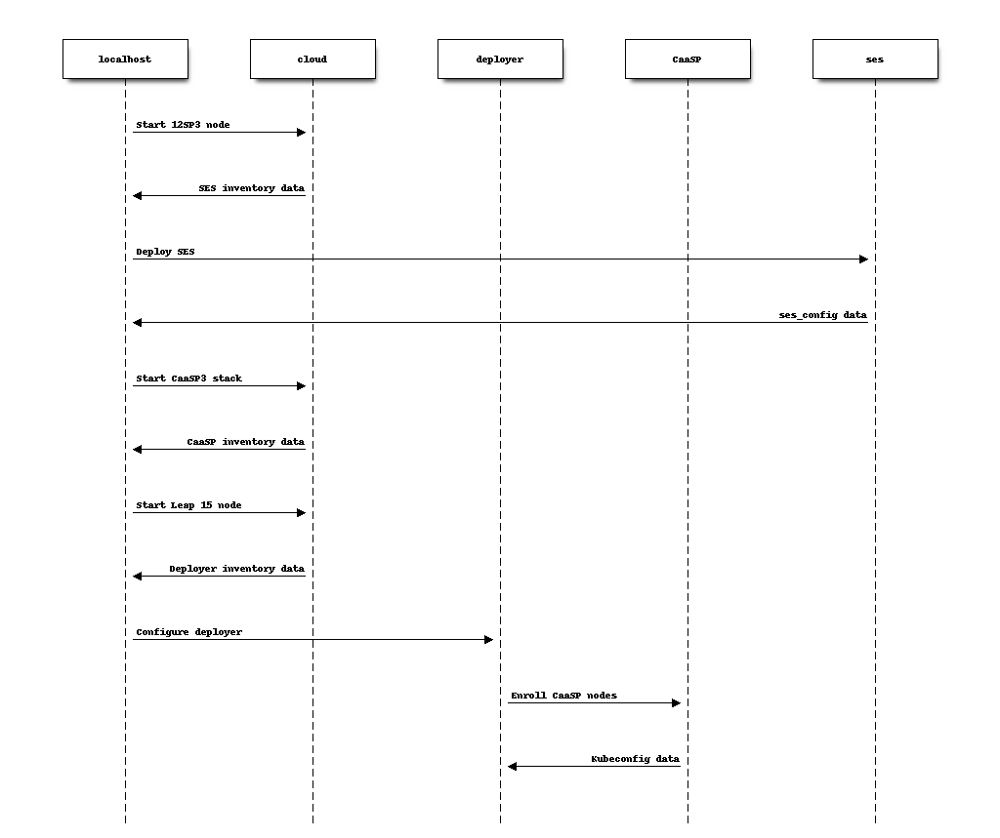

.. _reference:

=========
Reference
=========

This chapter contains all the extra reference information (i.e. in more
details) about the socok8s repository.

For information on how to deploy socok8s, refer to :ref:`deploymentguide`.

For information on how to manage and operate socok8s, refer to
:ref:`operationsdocumentation`.

For information on how to contribute to socok8s, refer to
:ref:`developerdocumentation`.

.. _projecthistory:

Project history
===============

This project started as a way to build and test the OpenStack-Helm charts for
SUSE, on our SUSE products: The Container as a Service Platform (CaaSP), and
the SUSE Enterprise Storage (SES).

It started as a series of shell scripts and ansible playbooks, choosing the
simplest and fastest way to bring a test infrastructure for the upstream
charts.

However, the mechanism of deployment was very flexible from day one, to allow
developers to test independently their changes. It would allow them to, like any
user/customer would, override specific parts of the deployment.

Project goals
=============

* Simplicity
* Be stable
* Use latest stable products from SUSE
* Carry the strict minimum amount of code to support upstream work on SUSE products.
* Be packagable/installable offline
* Leverage upstream first

Design considerations
=====================

In order to not pollute the developer/CI machine (called `localhost`),
all the data relevant for a deployment (like any eventual override) is stored
in a user-space |socok8s_workspace_default| folder, with unprivileged access.

This also helps the story of running behind
a corporate firewall: the `localhost` can be (connecting to)
a bastion host with the "deployment" actions happening behind the firewall.

Why...
======

... Ansible?
   Using Ansible is more robust than having written socok8s fully on shell
   scripts. It's ecosystem allows a nice interface to track deployment
   progress with ARA, run in a CI/CD like Zuul or Tower/AWX.

... OpenStack on top of Kubernetes on top of OpenStack by default in `run.sh`?
   We have a cloud for our Engineers, and that cloud is used for CI.
   From that point, creating a node for testing is as simple as doing an API
   call, and creating a stack of nodes is simple as re-using an existing heat
   stack code.

   As you might have read in the :ref:`projecthistory`, `run.sh` was mainly
   used for developers and CI. This is why the `run.sh` still points to
   `openstack` as default `DEPLOYMENT_MECHANISM`.

... OpenStack on top of Kubernetes?
   Long story short: Robustness.

... Splitting `run.sh` in so many steps?
   The current interface of `run.sh` is flexible enough to work for many
   different cases, and is semantically close to the actions that will happen
   to deploy OpenStack. `run.sh` itself is just an interface, behind the
   scenes, it runs a `DEPLOYMENT_MECHANISM` dependant script starting the
   appropriate ansible playbooks for the step called.

... A shell script for this interface?
   It was easier to start with a shell script than writing a CLI in <insert
   language here>, mostly because the shell script grew out of usage and
   CI needs.

... Installing from sources?
   Neither the socok8s repo nor the OpenStack-Helm project's repositories
   have been packaged for Leap/SLE 15, yet.

Image building process
======================

Upstream process
----------------

The OpenStack-Helm project tries to be agnostic of the images by
providing the ability for deployers to override any image used in the
charts.

However, the OpenStack-Helm project has a repository, `openstack-helm-images`,
containing a reference implementation for the images. That repository
holds the images used for the OpenStack-Helm project charts. All its images
are built with Docker.

`openstack-helm-images` provides Dockerfiles directly for all the
non-OpenStack images.

For the OpenStack images, `openstack-helm-images` contains shell scripts,
situated in `openstack/loci/`. The `build.sh` script is a thin wrapper around
`LOCI`. `LOCI` is the official OpenStack project to build OCI compliant
images of OpenStack projects. It uses `docker build` to construct images from
openstack sources and their requirements are expressed in `bindep` files
(`bindep.txt` for rpm/apt packages, `pydep.txt` for python packages).
The `build.sh` runs `LOCI` for the master branch. Other branches can be built
suing `build-{branchname}.sh` where `branchname` is the name of the OpenStack
branch (for example, `rocky`). See also :ref:`buildlociimages`.

In the future, `openstack-helm-images` could theoretically add images for
OpenStack which would be based on packages, by simply providing the appropriate
Dockerfiles.

Additionally, some images are not built in `openstack-helm-images`, and they
are directly consumed/fetched from upstream projects official dockerfiles,
like xrally.

socok8s process
---------------

socok8s leverages the existing OSH-images code.

When running the `build_images` step, the `localhost` asks the `deployer` to
build images based on the code that was checked in on the `deployer` node
using the `vars/manifest.yml`.

For the non-LOCI images, the `suse-build-images` role invoked in the
`build_images` step is simply running a `docker build` command.

For the LOCI images, the `suse-build-images` role simply runs the command
available in `openstack-helm-images` calling the LOCI build.

OpenStack-Helm chart overrides
==============================

Helm chart values overriding principle
--------------------------------------

A helm chart installation
(See https://helm.sh/docs/using_helm/#customizing-the-chart-before-installing )
accepts an argument named ``--values`` or ``-f``.

This argument expects the filename of a YAML file present on the
helm client machine. It can be specified multiple times, and
the rightmost file will take precedence.

For example, in the following example, the different values of
``socok8s-glance.yaml`` overrides would win over the existing values in
``/tmp/glance.yaml``:

.. code-block:: console

   helm upgrade --install glance ./glance --namespace=openstack \
     --values=/tmp/glance.yaml --values=/tmp/socok8s-glance.yaml

OpenStack-Helm scripts
----------------------

The OpenStack-Helm project provides shell scripts to deploy the helm charts,
with overrides per context (for example, multinode).

Those shell scripts calling the helm installation include an environment
variable, to allow users to pass extra arguments.

See for example https://github.com/openstack/openstack-helm/blob/c869b4ef4a0e95272155c5d5dd893c72976753cd/tools/deployment/multinode/100-glance.sh#L49 .

SUSE-ification of the OSH charts when deploying in OSH only mode
----------------------------------------------------------------

socok8s uses the previously explained environment variable to pass an extra
values file, a "SUSE"ified YAML. All the SUSEified files are present in
`playbooks/roles/deploy-osh/templates/`, for example `socok8s-glance.yml`,
**if they are not part of upstream yet**.

How deployers can extend a SUSEified OSH chart in OSH only mode
---------------------------------------------------------------

Deployers/customers to pass their own YAML overrides, in
user space (for example by using `extravars`), to extend the helm chart
behaviour beyond the "SUSE"ification.

To find those overrides, a user can look into
`playbooks/roles/deploy-osh/defaults/main.yml`.

SUSE-ification of the OSH charts when deploying with Airship
------------------------------------------------------------

...

How deployers can extend a SUSEified OSH chart with Airship
-----------------------------------------------------------

...

Summary "deploy on OpenStack" diagrams
======================================

Simplified network diagram
--------------------------

.. image:: simplified_network_diagram.png
   :scale: 100 %

OSH deploy on OpenStack process
-------------------------------

Setup hosts
~~~~~~~~~~~

This is the sequence of steps that generates, in OpenStack, the environment
for deploying OSH later.

Setup OpenStack
~~~~~~~~~~~~~~~

This is the sequence of steps that ends up with your OpenStack-Helm deployment.
The solid lines represent Ansible plays and their connections.

The dotted lines represent extra connections happening on the Ansible targets.

.. image:: setup_openstack.png
   :scale: 100 %

.. _envvars:

Environment variables
=====================

In socok8s
----------

``run.sh`` behaviour can be modified with environment variables.

``DEPLOYMENT_MECHANISM`` contains the target destination of the deploy
tooling. Currently set to ``openstack`` by default, but will later
include a ``baremetal`` and ``kvm``.

``SOCOK8S_DEVELOPER_MODE`` determines if you want to enter developer mode or
not. This adds a step for patching upstream code, builds images and then
continues the deployment.

``USE_ARA`` determines if you want to store records in ARA. Set its
value to 'True' for using ARA.

Ansible environment variables
-----------------------------

You can use Ansible environment variables to alter Ansible behaviour, for
example by being more verbose.

OpenStack-Helm environment variables
------------------------------------

OpenStack Helm deployment scripts accepts environment variables to alter their
behaviour. Read each of the scripts to know more about their override
mechanisms.

